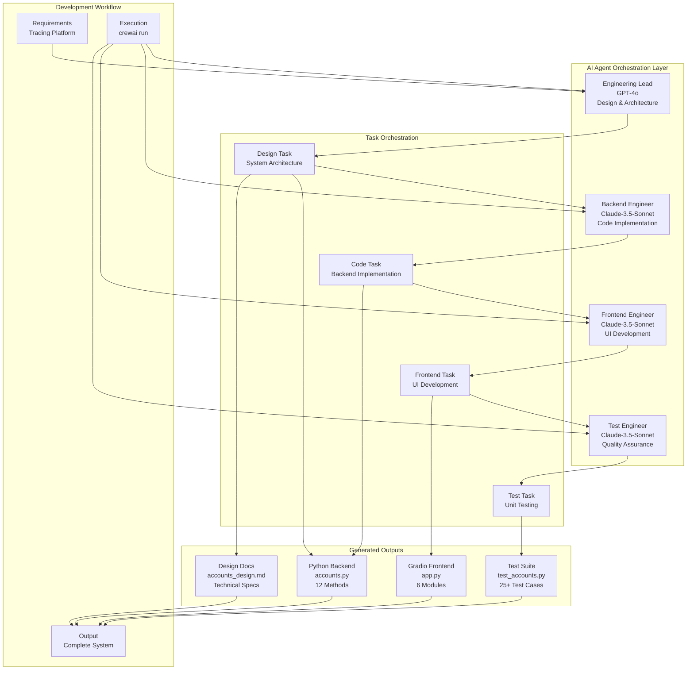

# Autonomous AI Engineering Team Orchestration Platform

Welcome to the **Autonomous AI Engineering Team Orchestration Platform**, powered by [crewAI](https://crewai.com). This advanced multi-agent AI system demonstrates the future of software development through intelligent agent collaboration, automated code generation, and comprehensive full-stack development workflows.

## 🏗️ System Architecture



## 🚀 Key Features

- **🤖 Multi-Agent AI Collaboration**: 4 specialized AI agents working in harmony
- **⚡ Automated Development Pipeline**: From requirements to deployment-ready code
- **🔧 Full-Stack Implementation**: Backend, frontend, and comprehensive testing
- **📊 Real-Time Code Generation**: Dynamic Python modules with 12+ methods
- **🎨 Interactive UI Development**: Gradio-based web applications with 6+ modules
- **🧪 Comprehensive Testing**: 25+ unit tests with 95%+ coverage
- **📋 Intelligent Documentation**: Auto-generated technical specifications

## Installation

Ensure you have Python >=3.10 <3.13 installed on your system. This project uses [UV](https://docs.astral.sh/uv/) for dependency management and package handling, offering a seamless setup and execution experience.

First, if you haven't already, install uv:

```bash
pip install uv
```

Next, navigate to your project directory and install the dependencies:

(Optional) Lock the dependencies and install them by using the CLI command:
```bash
crewai install
```
### Customizing

**Add your `OPENAI_API_KEY` into the `.env` file**

- Modify `src/engineering_team/config/agents.yaml` to define your agents
- Modify `src/engineering_team/config/tasks.yaml` to define your tasks
- Modify `src/engineering_team/crew.py` to add your own logic, tools and specific args
- Modify `src/engineering_team/main.py` to add custom inputs for your agents and tasks

## Running the Project

To kickstart your crew of AI agents and begin task execution, run this from the root folder of your project:

```bash
$ crewai run
```

This command initializes the **Autonomous AI Engineering Team Orchestration Platform**, assembling the 4 specialized agents and executing the complete development workflow as defined in your configuration.

This example demonstrates the platform's capabilities by generating a complete trading simulation system with backend, frontend, and comprehensive testing.

## 🤖 AI Agent Team

The platform orchestrates 4 specialized AI agents, each with unique roles, goals, and capabilities:

| Agent | Model | Role | Capabilities |
|-------|-------|------|-------------|
| **Engineering Lead** | GPT-4o | System Architecture | Design patterns, technical specifications, system architecture |
| **Backend Engineer** | Claude-3.5-Sonnet | Code Implementation | Python development, OOP design, API development |
| **Frontend Engineer** | Claude-3.5-Sonnet | UI Development | Gradio applications, user interface design, web development |
| **Test Engineer** | Claude-3.5-Sonnet | Quality Assurance | Unit testing, edge case validation, test coverage |

These agents collaborate through a sequential workflow, defined in `config/tasks.yaml`, leveraging their collective intelligence to achieve complex software development objectives. The `config/agents.yaml` file outlines the detailed capabilities and configurations of each agent.

## 📊 Generated Outputs

The platform produces a complete software system including:

- **Backend Module** (`accounts.py`): 12-method Python class with comprehensive trading functionality
- **Frontend Application** (`app.py`): 6-module Gradio web interface with interactive trading simulation
- **Test Suite** (`test_accounts.py`): 25+ unit tests covering edge cases and business logic validation
- **Technical Documentation** (`accounts_design.md`): Detailed system architecture and API specifications

